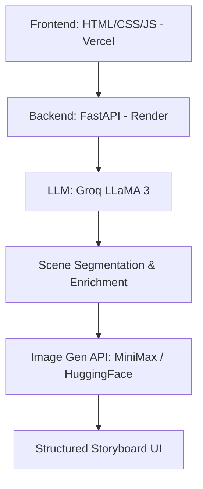

# AI Storyboard Generator (Pitch Visualizer)

**AI Storyboard Generator** is a powerful GenAI-driven system that transforms a simple narrative paragraph into a visually coherent, cinematically rich storyboard. Unlike standard text-to-image tools, this system focuses on **narrative continuity** and **semantic depth**, ensuring that every panel feels like a part of the same story.

---

## 🎯 Project Overview

This tool converts a short narrative (3–5 sentences) into a structured visual storyboard. By performing deep semantic understanding and narrative enrichment, the system maintains visual consistency across multiple generated scenes.

### 🧠 The Core Idea: Context-Aware Generation
Standard image generation often produces disjointed results for a multi-sentence story. Our pipeline solves this by:
1. **Segmenting** the story into distinct scenes.
2. **Extracting** global features (identity, setting, style).
3. **Enriching** each scene with context-aware attributes before generation.

---

## 🔥 Key Innovations

- **Global Context Maintenance:** Ensures the same characters, environment, and visual style persist through all storyboard panels.
- **Semantic Enrichment:** Instead of raw prompts, the system extracts tone, emotion, and environment to build "scene-level descriptions."
- **Continuous Narrative Flow:** Strategic prompt engineering prevents "style drift" between images.
- **Cinematic Vision:** Optimized for "pitch visualizers," providing professional-grade storyboard outputs.

---

## 🏗️ Architecture

The system follows a modern decoupled architecture for high performance and scalability:

- **Frontend:** Responsive, clean UI deployed on **Vercel**.
- **Backend:** High-performance asynchronous API built with **FastAPI**, deployed on **Render**.
- **LLM Layer:** **Groq (LLaMA models)** for lightning-fast semantic analysis and prompt enrichment.
- **Image Generation:** **MiniMax** or **HuggingFace (FLUX/Stable Diffusion)** for high-fidelity visual outputs.

---

## ⚙️ Tech Stack

### Backend
- **Python 3.10+**
- **FastAPI:** Modern, fast (high-performance) web framework.
- **AsyncIO & HTTPX:** For non-blocking parallel API calls.

### AI Engine
- **Groq Cloud:** Serving LLaMA 3 for rapid scene understanding.
- **Image Models:** MiniMax-video/image or HuggingFace Inference API.

### Frontend
- **Vanilla JS / HTML / CSS:** For a lightweight and responsive storyboard dashboard.

---

## 🔄 Pipeline Breakdown

1. **Input:** User submits a 3–5 sentence narrative.
2. **Segmentation:** The system breaks the paragraph into logical narrative "beats."
3. **Feature Extraction:** Extracts `tone`, `emotion`, `environment`, and `context` for every scene.
4. **Global Context Generation:** Identifies core character traits and visual style to be applied globally.
5. **Enrichment:** Merges scene attributes with global context to create highly detailed, consistent prompts.
6. **Prompt Engineering:** Converts enriched descriptions into technical prompts for the image models.
7. **Parallel Generation:** Uses `asyncio.gather` to generate all storyboard panels simultaneously.
8. **Storyboard UI:** Renders the final images alongside their original scene captions in a clean grid.

---

## 🎨 Features

- ✅ **Cinematic Prompting:** Automatic lighting, lens, and style injection.
- ✅ **Character Consistency:** Shared attributes across all generated panels.
- ✅ **Parallel Processing:** Optimized for speed using asynchronous execution.
- ✅ **Style Customization:** Choose between *Cinematic*, *Realistic*, *Animation*, or *Sketch* styles.
- ✅ **Clean UI:** Professional storyboard layout suitable for film/ad pitches.

---

## ⚡ Performance Optimizations

- **Concurrent Execution:** Parallelizing prompt enrichment and image generation reduces wait times by up to 60%.
- **Scene Limitation:** Optimized for 3–4 panels per generation to ensure high quality and fast response times.
- **Lightweight Frontend:** Minimal overhead for fast loading and interaction.

---

## 📦 Output Format

Each generated storyboard consists of:
- **Multiple Panels:** A visual grid representing the narrative flow.
- **Generated Images:** High-resolution assets maintaining stylistic coherence.
- **Captions:** The original narrative segment that inspired the visual.

---

## 🚀 Future Roadmap

- [ ] **Character Embeddings:** Using LoRA or Reference-Only models for exact character persistence.
- [ ] **Advanced Segmentation:** Smarter NLP for more complex narrative structures.
- [ ] **Video Generation:** Extending the storyboard into a short animatic using video-gen models.
- [ ] **Image Caching:** Integration with Cloudinary for permanent storage and faster retrieval.

---

## 📌 Summary

This project demonstrates the power of combining **Semantic LLM Understanding** with **Diffusion Models** to create a coherent, visually rich storytelling system. It moves beyond simple "text-to-image" and enters the realm of **Automated Visual Directing**.

---

### 📄 License
Distributed under the MIT License. See `LICENSE` for more information.

---

**Developed for AbinashB017 / AI Storytelling**
